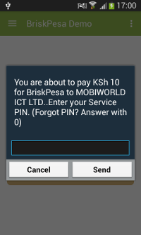
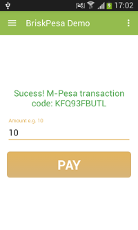

# BriskPesa

[](https://android-arsenal.com/api?level=8)

This is a sample application that shows how to integrate BriskPesa library with your android application.

BriskPesa facilitates android developers to integrate with M-Pesa seamlessly for in-app payments. Users do not need to leave the application to make M-Pesa payments.

## Screenshots



Try out the sample application on [Google Play](https://play.google.com/store/apps/details?id=com.briskpesa.briskpesademo).

<a href="https://play.google.com/store/apps/details?id=com.briskpesa.briskpesademo">
  
</a>

## Gradle Dependency
Use this dependency in your build.gradle file to reference BriskPesa library in your project

```groovy
compile 'com.mobiworld.briskpesa:briskpesa:1.0'
```

## Usages

In the xml : 

```xml
<com.mobiworld.briskpesa.BriskPesaView
         android:id="@+id/briskpesa"
         android:layout_width="match_parent"
         android:layout_gravity="center"
         android:layout_height="wrap_content"
         android:layout_marginTop="0dp"
         briskpesa:apiKey="YourBriskPesaGatewayKey" />
```
You can set phone and amount properties. Setting phone or amount means users will not be asked to enter these details.

```
	...
	briskpesa:phone="07xx"
	briskpesa:amount="10"
	...
```


Java side, you instantiate the view as follows.
```java
	BriskPesaView briskPesa = (BriskPesaView) v.findViewById(R.id.briskpesa);
```

If you need to set a phone number or amount, you can do it as follows.
```java
 //set phone
 briskPesa.setPhoneNumber("07xxx");
 //set amount
 briskPesa.setAmount(10);
```

If you need to do further processing when a transaction fails or succeeds, set a callback function as follows.
```java
	briskPesa.bpCallBack = new BriskPesaCallBack() {
     	public void callbackCall(int status, String mpesaCode, String desc) {
      		//TODO use params as necessary
      		Log.d("callBack", status + " " + mpesaCode + " " + desc);
      	}
	};
```

Ensure to wrap your code in a try catch code block:
```java
	try {
		//you code here
	}
	catch (BriskPesaException e) {
      	e.printStackTrace();
  	}
```

For support or enquiries please email support@mobiworld.co.ke or call +254 727 893 663.

## License

    Copyright 2016 Mobiworl ICT Solutions

    Licensed under the Apache License, Version 2.0 (the "License");
    you may not use this file except in compliance with the License.
    You may obtain a copy of the License at

       http://www.apache.org/licenses/LICENSE-2.0

    Unless required by applicable law or agreed to in writing, software
    distributed under the License is distributed on an "AS IS" BASIS,
    WITHOUT WARRANTIES OR CONDITIONS OF ANY KIND, either express or implied.
    See the License for the specific language governing permissions and
    limitations under the License.


